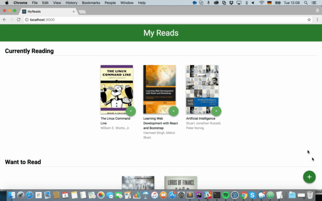

# MyReads-react-p1

The project of Udacity is using create-react-app to manage reading books. 


### Componets

App.js
│── BookShelf
│   │── BookShelf
│       │── Book
│           │── BookShelfChanger
│   
│── BookSearcher

## Getting Started


1. Clone the repository to your local computer.
2. Open the terminal and install the packages: `$ npm install`.
3. Under the project directory ,Run application `$ npm start`


### Prerequisites

* [react -](https://github.com/facebook/create-react-app) - Open the terminal and initialize globally
```
$ npm install -g create-react-app
```

### Installing

Open the terminal and install the packages

```
$ npm install

```

## Running

 - Run app

```
$ npm start
```


## Versioning

We use [SemVer](http://semver.org/) for versioning. For the versions available, see the [tags on this repository](https://github.com/your/project/tags).

## Authors

* **Tom gt** - *Fullstack egineer* - [github profile](https://github.com/tomgtqq)


## License

This project is licensed under the MIT License
